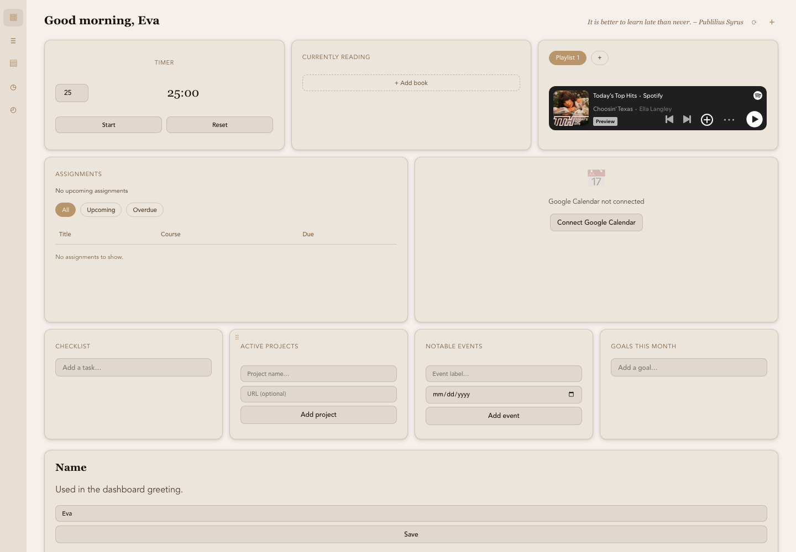

# Personal Dashboard

Personal Dashboard is a personal student dashboard that lives on your Mac. It pulls your Canvas assignments into one place and surrounds them with everything else you juggle during a semester: your Google Calendar week, a daily checklist, monthly goals, a reading list, active projects, countdowns to notable dates, a focus timer, your Spotify playlists, and photo panels — all arranged in a drag-and-droppable grid you can reshape however you like. Everything runs locally on your machine; your credentials and data never leave it.



## What you need

- A Mac with Apple Silicon (M1 or newer), running a recent macOS.
- Python 3 (macOS includes one once you have the Xcode Command Line Tools; run `xcode-select --install` if `python3 --version` says it's missing).
- Your own Canvas account, and (optionally) your own Google account for the calendar.

## Install

1. **Get the app.** Grab the `.dmg` from the [latest release](https://github.com/evadiva3/personal-dashboard/releases/latest) (or build it yourself — see "For developers" below), open it, and drag **canvas-hub** into your Applications folder.

2. **First open: bypass the Gatekeeper warning.** The app isn't signed with an Apple Developer certificate, so double-clicking it the first time shows a warning and refuses to open. Instead, **right-click (or Control-click) the app → Open → then click "Open"** in the dialog. You only have to do this once; afterwards it opens normally. If macOS still refuses, go to System Settings → Privacy & Security and click "Open Anyway" next to the canvas-hub message.

3. **Install the backend's Python packages.** The app runs a small local Python service for polling and storage. Install its dependencies into the `python3` on your PATH:

   ```sh
   python3 -m pip install --user -r /Applications/canvas-hub.app/Contents/Resources/backend/requirements.txt
   ```

   If you prefer a specific interpreter (conda, Homebrew, a venv), install the requirements there and launch the app once from Terminal with `CANVAS_HUB_PYTHON` pointing at it:

   ```sh
   CANVAS_HUB_PYTHON=/path/to/your/python /Applications/canvas-hub.app/Contents/MacOS/canvas-hub
   ```

## First launch: connect Canvas

The app opens to a "Connect Canvas" screen. It asks for your name (used in the dashboard greeting), your Canvas domain, and a personal access token.

To get the domain and token:

1. Log into Canvas in a browser.
2. Go to Account → Settings.
3. Scroll to "Approved Integrations" and click "+ New Access Token".
4. Copy the token immediately — it is shown once only.
5. Your domain is the part of the URL before ".instructure.com" — enter it as e.g. `school.instructure.com` (no `https://`).

The same steps are available inside the app under the collapsible "How do I get this?" section on that screen. The token is validated against your Canvas instance before anything is saved; credentials are stored in your macOS app-data directory (never in any repo, never logged).

## Connect Google Calendar (optional)

After Canvas connects you'll see an optional "Connect Google Calendar" screen — you can skip it and come back later via Settings. It needs a Google OAuth Client ID and Secret, which you create once in your own Google account:

1. Go to console.cloud.google.com and create a project.
2. Enable the Google Calendar API under APIs & Services → Library.
3. Configure the OAuth consent screen (External, add yourself as a test user).
4. Create OAuth credentials under APIs & Services → Credentials → Create Credentials → OAuth client ID → Desktop app.
5. Copy the Client ID and Secret into the app.

When you hit Connect, your regular browser opens Google's consent screen (standard desktop-app OAuth with a local redirect). The requested scope is read-only — the app can never create, edit, or delete your events. Tokens refresh automatically, so you only consent once.

## Using the dashboard

- **Assignments** — synced from Canvas every 30 minutes, with all/upcoming/overdue tabs and a "next deadline" line. New assignments trigger a native notification.
- **Calendar** — a scrollable week view of your Google Calendar with prev/next/today navigation.
- **Checklist / Goals** — a daily to-do list, plus goals scoped to the current month.
- **Currently reading** — paste any book URL; the app resolves a cover image automatically (or shows a placeholder).
- **Active projects** — name + optional URL; click to open.
- **Notable events** — manual date countdowns; past ones fade instead of disappearing.
- **Timer** — a 1–180 minute focus countdown with a notification when it finishes. Intentionally resets on restart.
- **Spotify** — paste a playlist URL and the widget shows its cover art and name; click the cover to open the playlist in Spotify. Add several and switch with tabs.
- **Photos** — click the **+** button in the header to add a photo into a grid zone of your choice (if every zone is full, add a row first in Settings).
- **Layout** — drag the ⠿ handle to move widgets within or between rows; rows grow and shrink automatically to fit. Right-click a widget to span columns or move it between rows. Settings → Dashboard layout lets you add, delete, reorder, and resize rows.
- **Settings** — change your display name, disconnect/reconnect Canvas or Google Calendar, and edit the layout. A tray icon keeps the app running in the background (Show/Hide/Quit).

## Known limitations

- **Single-user, local-only app.** There's no sync, no server, no accounts — everything lives on the one Mac it's installed on.
- **Bring your own credentials.** Every user connects their own Canvas access token and (optionally) their own Google OAuth client; nothing is shared or baked in.
- **macOS only, Apple Silicon only (for now).** No Windows/Linux builds, no Intel Mac build.
- **Unsigned build.** Until it's signed with an Apple Developer certificate, first launch requires the right-click → Open dance described above.
- **Python required at runtime.** The backend is bundled as source and needs a Python 3 with its requirements installed (see Install step 3); it isn't a self-contained binary yet.
- Google OAuth clients left in "Testing" mode can have their tokens expire after ~7 days unless you're added as a test user on your own project (step 3 above covers this).

## For developers

Stack: Tauri 2 (Rust shell) + FastAPI (Python backend spawned as a localhost-only subprocess on port 8742) + SQLite + APScheduler, with a plain HTML/JS frontend in the webview.

```sh
# prerequisites: rustup (aarch64-apple-darwin), Xcode CLT, Node.js, Python 3
npm install
python3 -m pip install -r backend/requirements.txt
npm run tauri dev      # run in development
npm run tauri build    # produce the .app and .dmg under src-tauri/target/release/bundle/
```

If your backend interpreter isn't the `python3` on PATH, set `CANVAS_HUB_PYTHON=/path/to/python` before running.

```
src/            frontend (vanilla HTML/JS, runs in the Tauri webview)
src-tauri/      Rust shell: tray, autostart, secure store, backend process lifecycle
backend/        FastAPI app — one module + router per data source
  app/modules/canvas/     Canvas client, poller, credentials cache
  app/modules/calendar/   Google Calendar OAuth flow + poller
  app/modules/books/      cover resolution (direct image / og:image / Google Books)
  app/modules/photos/     local file storage for photo panels
  app/routers/            HTTP endpoints per module
```

Credentials live in Tauri's store (`~/Library/Application Support/com.canvashub.app/`) plus an operational copy for the backend scheduler (`~/Library/Application Support/canvas-hub/`, permissions 0600). Neither is inside the git tree; `config.example.json` is reference-only and never read by the app.

*This README was written by Claude.*
